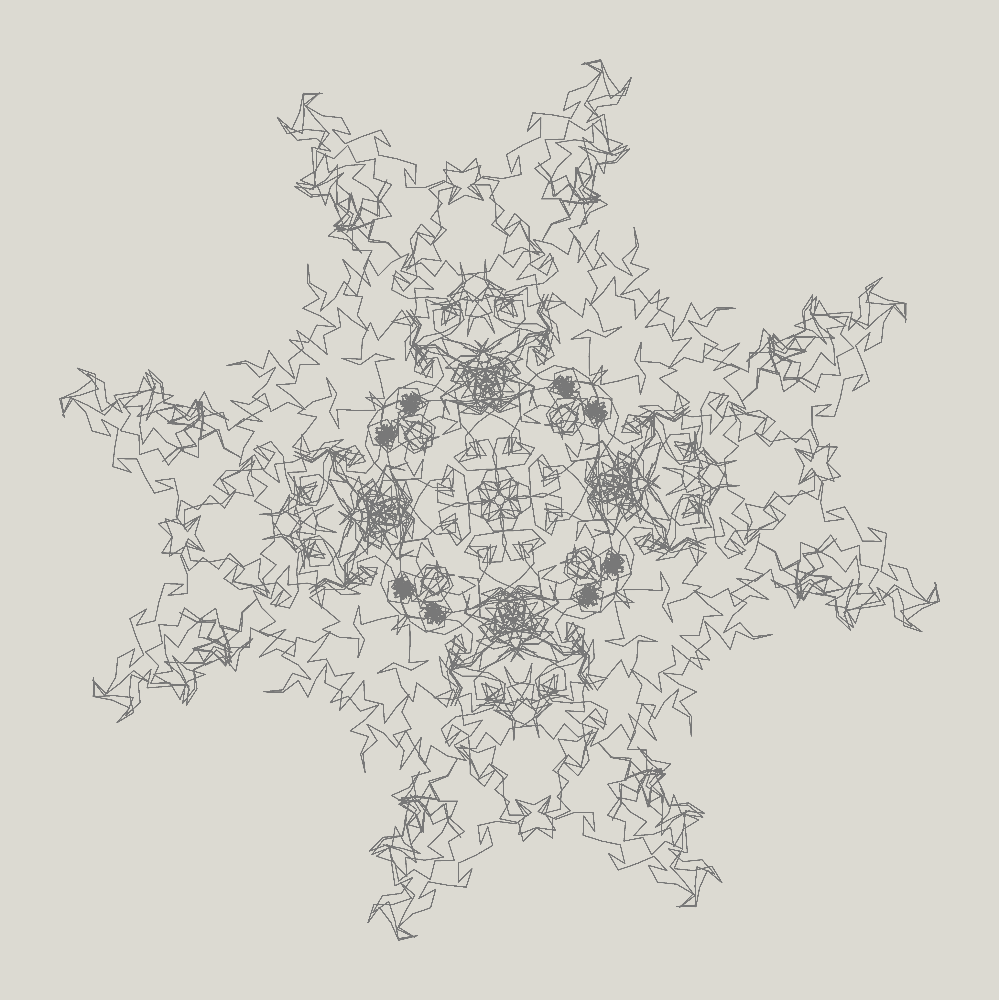

# Exponential Sum Spiral

This spiral is generated from the exponential sum function:

$$
f(n) = \frac{n}{dd} + \frac{n^2}{mm} + \frac{n^3}{yyyy}
$$

Can you guess the values of `dd`, `mm`, and `yyyy` hidden inside the function?

<!-- Image scales with page width while keeping aspect ratio -->


> **Note:** The Python code below to generate this spiral was written by ChatGPT.

```python
# Python code written by ChatGPT to generate this spiral
import numpy as np
import matplotlib.pyplot as plt

# Parameters (replace dd, mm, yyyy with your guessed values)
N = 25000
a1, a2, a3 = 1/dd, 1/mm, 1/yyyy
S_real = np.zeros(N)
S_imag = np.zeros(N)
S = 0 + 0j

# Compute partial sums
for n in range(1, N+1):
    f_n = a1*n + a2*n**2 + a3*n**3
    S += np.exp(2j * np.pi * f_n)
    S_real[n-1] = S.real
    S_imag[n-1] = S.imag

# Plot settings
bg_color = (220/255, 218/255, 210/255)
line_color = (120/255, 120/255, 120/255)

fig, ax = plt.subplots(figsize=(8,8), dpi=300)
fig.patch.set_facecolor(bg_color)
ax.set_facecolor(bg_color)
ax.plot(S_real, S_imag, color=line_color, linewidth=0.5)

ax.axis('off')
ax.set_aspect('equal')
plt.savefig("bd_25000.png", dpi=300, bbox_inches='tight', pad_inches=0, facecolor=bg_color)
plt.show()
